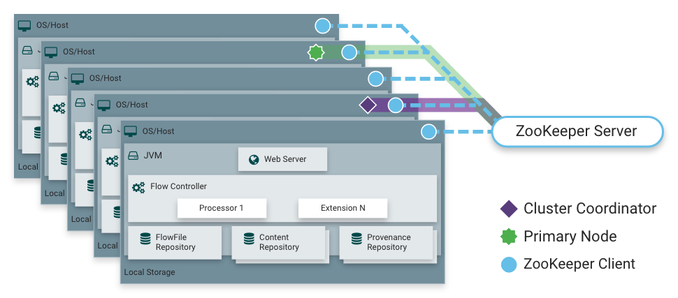

**Indice**

1. [Zookeeper](#id1)
2. [Nifi](#id2)
3. [Flink](#id3)
4. [Keycloack](#id4)
5. [Airflow](#id5)
-------------

## ZooKeeper<a name="id1"></a>

## ¿Qué es ZooKeeper? ##

*ZooKeeper* es un servicio centralizado para mantener la información de configuración, nombrar, proporcionar sincronización distribuida y proporcionar servicios de grupo. Todos estos tipos de servicios son utilizados de una forma u otra por las aplicaciones distribuidas. Cada vez que se implementan hay mucho trabajo que se dedica a corregir los errores y las condiciones de ejecucion que son inevitables. Debido a la dificultad de implementar este tipo de servicios, las aplicaciones inicialmente suelen escatimar en ellos, lo que los hace frágiles en presencia de cambios y difíciles de gestionar. Incluso cuando se hacen correctamente, las diferentes implementaciones de estos servicios conducen a la complejidad de la gestión cuando se implementan las aplicaciones.

### Un servicio de coordinación distribuida para aplicaciones distribuidas ###

ZooKeeper es un servicio de coordinación distribuido y de código abierto para aplicaciones distribuidas. Expone un conjunto simple de primitivas sobre las que las aplicaciones distribuidas pueden basarse para implementar servicios de nivel superior para la sincronización, el mantenimiento de la configuración y los grupos y nombres. Está diseñado para ser fácil de programar y utiliza un modelo de datos con el estilo de la conocida estructura de árbol de directorios de los sistemas de archivos. Se ejecuta en Java y tiene enlaces para Java y C.

Los servicios de coordinación son notoriamente difíciles de conseguir. Son especialmente propensos a errores como las condiciones de carrera y el estancamiento. La motivación detrás de ZooKeeper es aliviar a las aplicaciones distribuidas la responsabilidad de implementar los servicios de coordinación desde cero.

### Objetivos de diseño ###

ZooKeeper es sencillo. ZooKeeper permite que los procesos distribuidos se coordinen entre sí a través de un espacio de nombres jerárquico compartido que está organizado de manera similar a un sistema de archivos estándar. El espacio de nombres consta de registros de datos, llamados znodes, en el lenguaje ZooKeeper, y estos son similares a los archivos y directorios. A diferencia de un sistema de archivos típico, que está diseñado para el almacenamiento, los datos de ZooKeeper se mantienen en memoria, lo que significa que ZooKeeper puede lograr un alto rendimiento y bajos números de latencia.

La implementación de ZooKeeper da prioridad al acceso de alto rendimiento, de alta disponibilidad y estrictamente ordenado. Los aspectos de rendimiento de ZooKeeper significan que se puede utilizar en sistemas grandes y distribuidos. Los aspectos de fiabilidad impiden que sea un único punto de fallo. El orden estricto significa que se pueden implementar primitivas de sincronización sofisticadas en el cliente.

ZooKeeper se replica. Al igual que los procesos distribuidos que coordina, ZooKeeper en sí está destinado a ser replicado en un conjunto de hosts llamados conjunto.


Todos los servidores que componen el servicio ZooKeeper deben conocerse mutuamente. Mantienen una imagen de estado en memoria, junto con registros de transacciones e instantáneas en un almacén persistente. Mientras la mayoría de los servidores estén disponibles, el servicio ZooKeeper estará disponible.

Los clientes se conectan a un único servidor ZooKeeper. El cliente mantiene una conexión TCP a través de la cual envía solicitudes, recibe respuestas, obtiene eventos de reloj y envía latidos cardíacos. Si la conexión TCP al servidor se rompe, el cliente se conectará a un servidor diferente.

Se pide ZooKeeper. ZooKeeper marca cada actualización con un número que refleja el orden de todas las transacciones de ZooKeeper. Las operaciones posteriores pueden utilizar el orden para implementar abstracciones de nivel superior, como primitivas de sincronización.

ZooKeeper es rápido. Es especialmente rápido en cargas de trabajo "predominantes de lectura". Las aplicaciones de ZooKeeper se ejecutan en miles de máquinas, y funciona mejor cuando las lecturas son más comunes que las escrituras, con proporciones de alrededor de 10:1.

### Modelo de datos y espacio de nombres jerárquico ###

El espacio de nombres proporcionado por ZooKeeper es muy parecido al de un sistema de archivos estándar. Un nombre es una secuencia de elementos de ruta separados por una barra diagonal (/). Cada nodo del espacio de nombres de ZooKeeper se identifica mediante una ruta.

### Espacio de nombres jerárquico de ZooKeeper ###


### Nodos y nodos efímeros ###

A diferencia de los sistemas de archivos estándar, cada nodo de un espacio de nombres de ZooKeeper puede tener datos asociados, así como hijos. Es como tener un sistema de archivos que permite que un archivo también sea un directorio. (ZooKeeper fue diseñado para almacenar datos de coordinación: información de estado, configuración, información de ubicación, etc., por lo que los datos almacenados en cada nodo suelen ser pequeños, en el rango de byte a kilobyte). Utilizamos el término znode para dejar claro que estamos hablando de nodos de datos de ZooKeeper.

Znodes mantiene una estructura de estadísticas que incluye números de versión para cambios de datos, cambios de ACL y marcas de tiempo, para permitir validaciones de caché y actualizaciones coordinadas. Cada vez que cambian los datos de un znode, el número de versión aumenta. Por ejemplo, cada vez que un cliente recupera datos, también recibe la versión de los datos.

Los datos almacenados en cada znode de un espacio de nombres se leen y escriben atómicamente. Las lecturas obtienen todos los bytes de datos asociados a un znode y una escritura reemplaza a todos los datos. Cada nodo tiene una lista de control de acceso (ACL) que restringe quién puede hacer qué.

ZooKeeper también tiene la noción de nodos efímeros. Estos znodes existen siempre y cuando la sesión que creó el znode esté activa. Cuando finaliza la sesión, se elimina el znode.

### Actualizaciones condicionales y relojes ###

ZooKeeper apoya el concepto de relojes. Los clientes pueden configurar un reloj en un znode. Se activará y retirará un reloj cuando cambie el znode. Cuando se activa un reloj, el cliente recibe un paquete que dice que el znode ha cambiado. Si se rompe la conexión entre el cliente y uno de los servidores de ZooKeeper, el cliente recibirá una notificación local.

**Nuevo en 3.6.0:** Los clientes también pueden establecer relojes permanentes y recursivos en un znode que no se eliminan cuando se activan y que activan cambios en el znode registrado, así como en cualquier znodo hijo de forma recursiva.

### Garantías ###

ZooKeeper es muy rápido y muy sencillo. Sin embargo, dado que su objetivo es ser una base para la construcción de servicios más complicados, como la sincronización, proporciona un conjunto de garantías. Estos son:

**Consistencia secuencial:** las actualizaciones de un cliente se aplicarán en el orden en que se enviaron.

**Atomicity** - Las actualizaciones tienen éxito o fallan. No hay resultados parciales.

**Imagen única del sistema:** un cliente verá la misma vista del servicio independientemente del servidor al que se conecte. Es decir, un cliente nunca verá una vista anterior del sistema, incluso si el cliente falla en un servidor diferente con la misma sesión.

**Fiabilidad:** una vez que se haya aplicado una actualización, persistirá desde ese momento hasta que un cliente sobrescriba la actualización.

**Puntualidad:** se garantiza que la vista de los clientes del sistema estará actualizada dentro de un plazo determinado.

### API sencilla ###

Uno de los objetivos de diseño de ZooKeeper es proporcionar una interfaz de programación muy sencilla. Como resultado, solo admite estas operaciones:

Create : crea un nodo en una ubicación del árbol

Delete : elimina un nodo

Exists : comprueba si existe un nodo en una ubicación

Get Data : lee los datos de un nodo

Set Data : escribe datos en un nodo

Get children : recupera una lista de hijos de un nodo

Sync : espera a que se propaguen los datos


### Ejecución ###

ZooKeeper Components muestra los componentes de alto nivel del servicio ZooKeeper. Con la excepción del procesador de solicitudes, cada uno de los servidores que componen el servicio ZooKeeper replica su propia copia de cada uno de los componentes.


La base de datos replicada es una base de datos en memoria que contiene todo el árbol de datos. Las actualizaciones se registran en el disco para su recuperación, y las escrituras se serializan en el disco antes de que se apliquen a la base de datos en memoria.

Todos los clientes de servicios de servidores de ZooKeeper. Los clientes se conectan exactamente a un servidor para enviar solicitudes. Las solicitudes de lectura se atienden desde la réplica local de cada base de datos del servidor. Las solicitudes que cambian el estado del servicio, escriben solicitudes, se procesan mediante un protocolo de acuerdo.

Como parte del protocolo de acuerdo, todas las solicitudes de escritura de los clientes se reenvían a un único servidor, llamado líder. El resto de los servidores de ZooKeeper, llamados seguidores, reciben propuestas de mensajes del líder y acuerdan la entrega de mensajes. La capa de mensajería se encarga de reemplazar a los líderes en caso de fallos y sincronizar a los seguidores con los líderes.

ZooKeeper utiliza un protocolo de mensajería atómica personalizado. Dado que la capa de mensajería es atómica, ZooKeeper puede garantizar que las réplicas locales nunca diverjan. Cuando el líder recibe una solicitud de escritura, calcula cuál es el estado del sistema cuando se va a aplicar la escritura y la transforma en una transacción que captura este nuevo estado.

### Usos ###

La interfaz de programación de ZooKeeper es deliberadamente sencilla. Con él, sin embargo, puede implementar operaciones de orden superior, como primitivas de sincronización, pertenencia a grupos, propiedad, etc.

---------------
# Nifi<a name="id2"></a>

### ¿Qué es Apache NiFi? ###

En pocas palabras, NiFi se creó para automatizar el flujo de datos entre sistemas. Si bien el término "flujo de datos" se utiliza en una variedad de contextos, lo usamos aquí para referirse al flujo automatizado y gestionado de información entre sistemas. Este espacio problemático ha existido desde que las empresas tenían más de un sistema, donde algunos de los sistemas creaban datos y algunos de los sistemas consumían datos. Los problemas y patrones de solución que surgieron se han discutido y articulado ampliamente. Una forma completa y fácilmente consumida se encuentra en los Patrones de Integración Empresarial [eip].

Algunos de los desafíos de alto nivel del flujo de datos incluyen:

**Los sistemas fallan**

Las redes fallan, los discos fallan, el software se bloquea, la gente comete errores.

**El acceso a los datos supera la capacidad de consumo**

A veces, una fuente de datos determinada puede superar alguna parte de la cadena de procesamiento o entrega: solo se necesita un eslabón débil para tener un problema.

**Las condiciones límite son meras sugerencias**

Invariablemente obtendrá datos que son demasiado grandes, demasiado pequeños, demasiado rápidos, demasiado lentos, corruptos, incorrectos o en el formato incorrecto.

**¿Qué es el ruido un día se convierte en señal al siguiente?**

Las prioridades de una organización cambian rápidamente. Permitir nuevos flujos y cambiar los existentes debe ser rápido.

**Los sistemas evolucionan a diferentes ritmos**

Los protocolos y formatos utilizados por un sistema determinado pueden cambiar en cualquier momento y, a menudo, independientemente de los sistemas que los rodean. Dataflow existe para conectar lo que es esencialmente un sistema de componentes distribuido masivamente que están diseñados vagamente o nada para funcionar juntos.

**Cumplimiento y seguridad**

Las leyes, reglamentos y políticas cambian. Los acuerdos de empresa a empresa cambian. Las interacciones de sistema a sistema y de sistema a usuario deben ser seguras, fiables y responsables.

**Se produce una mejora continua en la producción**

A menudo no es posible acercarse incluso a replicar entornos de producción en el laboratorio.

A lo largo de los años, el flujo de datos ha sido uno de esos males necesarios en una arquitectura. Ahora bien, sin embargo, hay una serie de movimientos activos y en rápida evolución que hacen que el flujo de datos sea mucho más interesante y mucho más vital para el éxito de una empresa determinada. Estos incluyen cosas como; Arquitectura orientada a servicios [soa], el auge de la API [api][api2], Internet de las cosas [iot] y Big Data [bigdata]. Además, el nivel de rigor necesario para el cumplimiento, la privacidad y la seguridad aumenta constantemente. Incluso con todos estos nuevos conceptos, los patrones y las necesidades del flujo de datos siguen siendo en gran medida los mismos. Las principales diferencias son entonces el alcance de la complejidad, la tasa de cambio necesaria para adaptarse y que, a escala, el caso de borde se convierte en una ocurrencia común. NiFi está diseñado para ayudar a abordar estos desafíos modernos de flujo de datos.

### Los conceptos básicos de NiFi ###

Los conceptos fundamentales de diseño de NiFi se relacionan estrechamente con las principales ideas de la programación basada en flujo [fbp]. Estos son algunos de los principales conceptos de NiFi y cómo se asignan a FBP:


Término NiFi	| Término FBP	| Descripción
|---------------|---------------|-------------
FlowFile|Paquete de información|Un FlowFile representa cada objeto que se mueve a través del sistema y, para cada uno, NiFi realiza un seguimiento de un mapa de cadenas de atributos de par clave/valor y su contenido asociado de cero o más bytes.|
Procesador FlowFile|Caja negra|Los procesadores realizan el trabajo. En términos [eip], un procesador está haciendo alguna combinación de enrutamiento de datos, transformación o mediación entre sistemas. Los procesadores tienen acceso a los atributos de un FlowFile determinado y a su flujo de contenido. Los procesadores pueden operar en cero o más FlowFiles en una unidad de trabajo determinada y confirmar ese trabajo o revertir.|
Conexión|Búfer delimitado|Las conexiones proporcionan el vínculo real entre los procesadores. Estos actúan como colas y permiten que varios procesos interactúen a diferentes velocidades. Estas colas se pueden priorizar dinámicamente y pueden tener límites superiores en la carga, lo que permite la contrapresión.|
Controlador de flujo|Programador|El controlador de flujo mantiene el conocimiento de cómo se conectan los procesos y gestiona los hilos y las asignaciones de los mismos que utilizan todos los procesos. El controlador de flujo actúa como agente facilitando el intercambio de archivos de flujo entre procesadores.|
Grupo de procesos|Subred|Un grupo de procesos es un conjunto específico de procesos y sus conexiones, que pueden recibir datos a través de puertos de entrada y enviar datos a través de puertos de salida. De esta manera, los grupos de procesos permiten la creación de componentes completamente nuevos simplemente mediante la composición de otros componentes.

Este modelo de diseño, también similar a [seda], proporciona muchas consecuencias beneficiosas que ayudan a NiFi a ser una plataforma muy eficaz para crear flujos de datos potentes y escalables. Algunos de estos beneficios incluyen:

- Presta bien a la creación visual y a la gestión de gráficos dirigidos de procesadores

- Es inherentemente asíncrono, lo que permite un rendimiento muy alto y un amortiguamiento natural, incluso cuando el procesamiento y los caudales fluctúan

- Proporciona un modelo altamente simultáneo sin que un desarrollador tenga que preocuparse por las complejidades típicas de la concurrencia

- Promueve el desarrollo de componentes cohesivos y poco acoplados que luego se pueden reutilizar en otros contextos y promueve unidades comprobables

- Las conexiones con recursos limitados hacen que funciones críticas como la contrapresión y la liberación de presión sean muy naturales e intuitivas

- El manejo de errores se vuelve tan natural como el camino feliz en lugar de un catch-all de grano grueso

- Los puntos en los que los datos entran y salen del sistema, así como la forma en que fluyen, se entienden bien y se rastrean fácilmente

### Arquitectura NiFi ###


NiFi se ejecuta dentro de una JVM en un sistema operativo host. Los componentes principales de NiFi en la JVM son los siguientes:

### Web Server ###

El propósito del servidor web es alojar la API de comando y control basada en HTTP de NiFi.

### Flow Controller ###

El controlador de flujo es el cerebro de la operación. Proporciona subprocesos para que las extensiones se ejecuten y gestiona la programación de cuándo las extensiones reciben recursos para ejecutar.

### Extensiones ###

Hay varios tipos de extensiones de NiFi que se describen en otros documentos. El punto clave aquí es que las extensiones operan y se ejecutan dentro de la JVM.

### Repositorio FlowFile ###

El repositorio FlowFile es donde NiFi realiza un seguimiento del estado de lo que sabe sobre un FlowFile dado que actualmente está activo en el flujo. La implementación del repositorio se puede conectar. El enfoque predeterminado es un registro de escritura con anticipación persistente ubicado en una partición de disco especificada.

### Repositorio de contenido ###

El repositorio de contenido es donde viven los bytes de contenido reales de un FlowFile determinado. La implementación del repositorio se puede conectar. El enfoque predeterminado es un mecanismo bastante simple, que almacena bloques de datos en el sistema de archivos. Se puede especificar más de una ubicación de almacenamiento del sistema de archivos para obtener diferentes particiones físicas activadas para reducir la contención en un solo volumen.

### Repositorio de procedencia ###

El repositorio de procedencia es donde se almacenan todos los datos de eventos de procedencia. La construcción del repositorio se puede conectar y la implementación predeterminada es utilizar uno o más volúmenes de disco físico. Dentro de cada ubicación, los datos del evento se indexan y se pueden buscar.

**NiFi también puede operar dentro de un clúster.**



A partir de la versión de NiFi 1.0, se emplea un paradigma de clúster de líder cero. Cada nodo de un clúster de NiFi realiza las mismas tareas en los datos, pero cada uno opera con un conjunto diferente de datos. Apache ZooKeeper elige un solo nodo como coordinador del clúster, y ZooKeeper gestiona automáticamente la conmutación por error. Todos los nodos del clúster informan de latidos cardíacos e información de estado al coordinador del clúster. El coordinador del clúster es responsable de desconectar y conectar los nodos. Además, cada clúster tiene un nodo principal, también elegido por ZooKeeper. Como administrador de DataFlow, puede interactuar con el clúster de NiFi a través de la interfaz de usuario (UI) de cualquier nodo. Cualquier cambio que realice se replica en todos los nodos del clúster, lo que permite múltiples puntos de entrada.


### Expectativas de rendimiento y características de NiFi ###

NiFi está diseñado para aprovechar al máximo las capacidades del sistema host subyacente en el que opera. Esta maximización de los recursos es particularmente fuerte con respecto a la CPU y el disco. Para obtener más información, consulte las prácticas recomendadas y los consejos de configuración en la Guía de administración.

**Para E/S**

El rendimiento o la latencia que uno puede esperar ver varía mucho, dependiendo de cómo esté configurado el sistema. Dado que hay enfoques enchufables para la mayoría de los principales subsistemas NiFi, el rendimiento depende de la implementación. Pero, para algo concreto y ampliamente aplicable, considere las implementaciones predeterminadas listas para usar. Todos estos son persistentes con entrega garantizada y lo hacen utilizando el disco local. Por lo tanto, siendo conservador, asuma una velocidad de lectura/escritura de aproximadamente 50 MB por segundo en discos modestos o volúmenes RAID dentro de un servidor típico. NiFi para una gran clase de flujos de datos debería ser capaz de alcanzar de manera eficiente los 100 MB por segundo o más de rendimiento. Esto se debe a que se espera un crecimiento lineal para cada partición física y repositorio de contenido añadido a NiFi. Esto será un cuello de botella en algún momento en el repositorio FlowFile y el repositorio de procedencia. Planeamos proporcionar una plantilla de evaluación comparativa y prueba de rendimiento para incluir en la compilación, lo que permite a los usuarios probar fácilmente su sistema e identificar dónde están los cuellos de botella y en qué momento podrían convertirse en un factor. Esta plantilla también debería facilitar a los administradores del sistema la introducción de cambios y la verificación del impacto.

**Para CPU**

El controlador de flujo actúa como el motor que dicta cuando a un procesador en particular se le da un subproceso para ejecutar. Los procesadores se escriben para devolver el hilo tan pronto como terminen de ejecutar una tarea. Al controlador de flujo se le puede dar un valor de configuración que indica los subprocesos disponibles para los diversos grupos de subprocesos que mantiene. El número ideal de subprocesos a utilizar depende de los recursos del sistema host en términos de número de núcleos, si ese sistema también está ejecutando otros servicios y la naturaleza del procesamiento en el flujo. Para los flujos típicos pesados de E/S, es razonable poner a disposición muchas docenas de hilos.

**Para RAM**

NiFi vive dentro de la JVM y, por lo tanto, se limita al espacio de memoria que le proporciona la JVM. La recogida de basura JVM se convierte en un factor muy importante tanto para restringir el tamaño total del montón práctico como para optimizar el funcionamiento de la aplicación a lo largo del tiempo. Los trabajos de NiFi pueden ser intensivos en E/S cuando se lee el mismo contenido regularmente. Configura un disco lo suficientemente grande como para optimizar el rendimiento.

### Descripción general de alto nivel de las características clave de NiFi ###

Estas secciones proporcionan una vista de 20 000 pies de los fundamentos fundamentales de NiFi, para que puedas entender el panorama general de Apache NiFi y algunas de sus características más interesantes. Las categorías de características clave incluyen la gestión del flujo, la facilidad de uso, la seguridad, la arquitectura extensible y el modelo de escalado flexible.

**Gestión del flujo**

- **Entrega garantizada**

Una filosofía central de NiFi ha sido que, incluso a muy alta escala, la entrega garantizada es imprescindible. Esto se logra mediante el uso efectivo de un registro de escritura y un repositorio de contenido persistentes especialmente diseñados. Juntos están diseñados de tal manera que permiten tasas de transacción muy altas, una propagación de carga efectiva, una copia sobre escritura y la reproducción con los puntos fuertes de las lecturas/escrituras de disco tradicionales.


- **Amortiguación de datos con contrapresión y liberación de presión**

NiFi admite el almacenamiento en búfer de todos los datos en cola, así como la capacidad de proporcionar contrapresión a medida que esas colas alcanzan los límites especificados o de desactivar los datos a medida que alcanzan una edad específica (su valor ha perecido).

- **Cola Priorizada En La Cola**

NiFi permite establecer uno o más esquemas de priorización sobre cómo se recuperan los datos de una cola. El valor predeterminado es el más antiguo primero, pero hay momentos en los que los datos deben extraerse más nuevos primero, los más grandes primero o algún otro esquema personalizado.

- **QoS específico del flujo (producción de latencia v, tolerancia a la pérdida, etc.)**

Hay puntos de un flujo de datos en los que los datos son absolutamente críticos y son intolerantes a las pérdidas. También hay momentos en los que debe procesarse y entregarse en cuestión de segundos para tener cualquier valor. NiFi permite la configuración específica de flujo de grano fino de estas preocupaciones.

**Facilidad de uso**

- **Comando y control visual**

Los flujos de datos pueden volverse bastante complejos. Ser capaz de visualizar esos flujos y expresarlos visualmente puede ayudar en gran medida a reducir esa complejidad e identificar las áreas que deben simplificarse. NiFi permite no solo el establecimiento visual de flujos de datos, sino que también lo hace en tiempo real. En lugar de ser "diseñar e implementar", es mucho más como moldear arcilla. Si realiza un cambio en el flujo de datos, ese cambio entra inmediatamente en vigor. Los cambios son de grano fino y aislados a los componentes afectados. No es necesario detener todo un flujo o conjunto de flujos solo para hacer alguna modificación específica.

- **Plantillas de flujo**

Los flujos de datos tienden a estar altamente orientados a los patrones y, aunque a menudo hay muchas formas diferentes de resolver un problema, es muy útil poder compartir esas mejores prácticas. Las plantillas permiten a los expertos en la materia construir y publicar sus diseños de flujo y que otros se beneficien y colaboren en ellos.

- **Procedencia de datos**

NiFi registra, indexa y pone a disposición automáticamente los datos de procedencia a medida que los objetos fluyen a través del sistema incluso a través de fan-in, fan-out, transformaciones y más. Esta información se vuelve extremadamente crítica para apoyar el cumplimiento, la solución de problemas, la optimización y otros escenarios.

- **Recuperación/grabación de un búfer rodante de historial de grano fino**

El repositorio de contenido de NiFi está diseñado para actuar como un búfer continuo de la historia. Los datos se eliminan solo a medida que envejecen fuera del repositorio de contenido o cuando se necesita espacio. Esto, combinado con la capacidad de procedencia de datos, lo convierte en una base increíblemente útil para permitir el clic en el contenido, la descarga de contenido y la reproducción, todo en un punto específico del ciclo de vida de un objeto que incluso puede abarcar generaciones.

**Seguridad**

- **Sistema a sistema**

Un flujo de datos solo es tan bueno como seguro. NiFi en cada punto de un flujo de datos ofrece un intercambio seguro mediante el uso de protocolos con cifrado como SSL de 2 vías. Además, NiFi permite al flujo cifrar y descifrar el contenido y utilizar claves compartidas u otros mecanismos a ambos lados de la ecuación remitente/receptor.

- **Usuario a sistema**

NiFi habilita la autenticación SSL bidireccional y proporciona una autorización enchufable para que pueda controlar correctamente el acceso de un usuario y a niveles particulares (solo lectura, administrador de flujo de datos, administrador). Si un usuario introduce una propiedad confidencial como una contraseña en el flujo, se cifra inmediatamente del lado del servidor y nunca volverá a exponerse en el lado del cliente, incluso en su forma cifrada.

- **Autorización multiinquilino**

El nivel de autoridad de un flujo de datos determinado se aplica a cada componente, lo que permite al usuario administrador tener un nivel de control de acceso fino. Esto significa que cada clúster de NiFi es capaz de gestionar los requisitos de una o más organizaciones. En comparación con las topologías aisladas, la autorización multiinquilino permite un modelo de autoservicio para la gestión del flujo de datos, lo que permite a cada equipo u organización gestionar los flujos con plena conciencia del resto del flujo, al que no tienen acceso.

**Arquitectura extensible**

- **Extensión**

NiFi está en su núcleo construido para la extensión y, como tal, es una plataforma en la que los procesos de flujo de datos pueden ejecutarse e interactuar de manera predecible y repetible. Los puntos de extensión incluyen: procesadores, servicios de controlador, tareas de informes, priorizadores e interfaces de usuario del cliente.

- **Aislamiento del cargador de clases**

Para cualquier sistema basado en componentes, pueden producirse rápidamente problemas de dependencia. NiFi aborda esto proporcionando un modelo de cargador de clases personalizado, asegurando que cada paquete de extensiones esté expuesto a un conjunto muy limitado de dependencias. Como resultado, las extensiones se pueden construir con poca preocupación por si podrían entrar en conflicto con otra extensión. El concepto de estos paquetes de extensión se llama "Archivos NiFi" y se discute con más detalle en la Guía del desarrollador.

- **Protocolo de comunicación de sitio a sitio**

El protocolo de comunicación preferido entre las instancias de NiFi es el protocolo NiFi de sitio a sitio (S2S). S2S facilita la transferencia de datos de una instancia de NiFi a otra de forma fácil, eficiente y segura. Las bibliotecas cliente de NiFi se pueden construir y agrupar fácilmente en otras aplicaciones o dispositivos para comunicarse con NiFi a través de S2S. Tanto el protocolo basado en sockets como el protocolo HTTP(S) son compatibles con S2S como protocolo de transporte subyacente, lo que permite incrustar un servidor proxy en la comunicación S2S.

**Modelo de escalado flexible**

- **Escalabilidad horizontal (amplo)**

NiFi está diseñado para escalar hacia fuera mediante el uso de agrupar muchos nodos como se ha descrito anteriormente. Si se aprovisiona y configura un solo nodo para manejar cientos de MB por segundo, entonces se podría configurar un clúster modesto para manejar GB por segundo. Esto provoca interesantes desafíos de equilibrio de carga y conmutación por error entre NiFi y los sistemas de los que obtiene datos. El uso de protocolos basados en colas asíncronas, como servicios de mensajería, Kafka, etc., puede ayudar. El uso de la función "sitio a sitio" de NiFi también es muy efectivo, ya que es un protocolo que permite a NiFi y a un cliente (incluido otro clúster de NiFi) hablar entre sí, compartir información sobre la carga e intercambiar datos en puertos autorizados específicos.

- **Escalar hacia arriba y hacia abajo**

NiFi también está diseñado para escalar hacia arriba y hacia abajo de una manera muy flexible. En términos de aumentar el rendimiento desde el punto de vista del marco NiFi, es posible aumentar el número de tareas simultáneas en el procesador en la pestaña Programación al configurar. Esto permite que más procesos se ejecuten simultáneamente, proporcionando un mayor rendimiento. Al otro lado del espectro, puede reducir perfectamente NiFi para que sea adecuado para ejecutarse en dispositivos perimetrales donde se desea una pequeña huella debido a los limitados recursos de hardware. Para resolver específicamente el desafío de recopilación de datos de la primera milla y los casos de uso perimetrales, puede encontrar más detalles aquí: https://cwiki.apache.org/confluence/display/NIFI/MiNiFi con respecto a un esfuerzo de proyecto hijo de Apache NiFi, MiNiFi (pronunciado "minify", [min-uh-fahy]).


----


## Flink<a name="id3"></a>


### ¿Qué es Apache Flink? — Arquitectura

Apache Flink es un marco y un motor de procesamiento distribuido para cálculos con estado a través de flujos de datos ilimitados y acotados. Flink ha sido diseñado para ejecutarse en todos los entornos de clúster comunes, realizar cálculos a velocidad en memoria y a cualquier escala.

Aquí explicamos aspectos importantes de la arquitectura de Flink.

### Procesar datos ilimitados y delimitados

Cualquier tipo de dato se produce como un flujo de eventos. Transacciones con tarjeta de crédito, mediciones de sensores, registros de máquinas o interacciones de usuarios en un sitio web o una aplicación móvil, todos estos datos se generan como un flujo.

Los datos se pueden procesar como flujos ilimitados o acotados.

1. Las secuencias ilimitadas tienen un inicio pero no un final definido. No terminan ni proporcionan datos a medida que se generan. Los flujos ilimitados deben procesarse continuamente, es decir, los eventos deben manejarse rápidamente después de haber sido ingeridos. No es posible esperar a que lleguen todos los datos de entrada porque la entrada no está limitada y no estará completa en ningún momento. El procesamiento de datos ilimitados a menudo requiere que los eventos se ingieran en un orden específico, como el orden en que ocurrieron los eventos, para poder razonar sobre la integridad del resultado.

2. Los flujos delimitados tienen un inicio y un final definidos. Los flujos delimitados se pueden procesar ingiriendo todos los datos antes de realizar cualquier cálculo. No se requiere la ingestión ordenada para procesar flujos delimitados porque siempre se puede ordenar un conjunto de datos acotado. El procesamiento de flujos acotados también se conoce como procesamiento por lotes.


**Apache Flink sobresale en el procesamiento de conjuntos de datos ilimitados y acotados.** El control preciso de la hora y el estado permite que el tiempo de ejecución de Flink ejecute cualquier tipo de aplicación en flujos ilimitados. Los flujos delimitados se procesan internamente mediante algoritmos y estructuras de datos diseñados específicamente para conjuntos de datos de tamaño fijo, lo que produce un excelente rendimiento.

Convénzase explorando los casos de uso que se han construido sobre Flink.

**Implementar aplicaciones en cualquier lugar**

Apache Flink es un sistema distribuido y requiere recursos informáticos para ejecutar aplicaciones. Flink se integra con todos los administradores de recursos de clúster comunes, como Hadoop YARN, Apache Mesos y Kubernetes, pero también se puede configurar para que se ejecute como un clúster independiente.

Flink está diseñado para funcionar bien cada uno de los gestores de recursos enumerados anteriormente. Esto se logra mediante modos de implementación específicos del administrador de recursos que permiten a Flink interactuar con cada administrador de recursos de su manera idiomática.

Al implementar una aplicación Flink, Flink identifica automáticamente los recursos necesarios en función del paralelismo configurado de la aplicación y los solicita al administrador de recursos. En caso de fallo, Flink reemplaza el contenedor fallido solicitando nuevos recursos. Toda la comunicación para enviar o controlar una solicitud se realiza a través de llamadas REST. Esto facilita la integración de Flink en muchos entornos.

**Ejecutar aplicaciones a cualquier escala**

Flink está diseñado para ejecutar aplicaciones de streaming con estado a cualquier escala. Las aplicaciones se paralelizan posiblemente en miles de tareas que se distribuyen y ejecutan simultáneamente en un clúster. Por lo tanto, una aplicación puede aprovechar cantidades prácticamente ilimitadas de CPU, memoria principal, disco y E/S de red. Además, Flink mantiene fácilmente un estado de aplicación muy grande. Su algoritmo de puntos de control asíncrono e incremental garantiza un impacto mínimo en las latencias de procesamiento, al tiempo que garantiza la consistencia del estado exactamente una vez.

Los usuarios informaron de impresionantes números de escalabilidad para las aplicaciones Flink que se ejecutan en sus entornos de producción, como

- Aplicaciones que procesan varios billones de eventos al día,

- Aplicaciones que mantienen varios terabytes de estado, y

- Aplicaciones que se ejecutan en miles de núcleos.

**Aprovechar el rendimiento en memoria**

Las aplicaciones de Flink con estado están optimizadas para el acceso al estado local. El estado de la tarea siempre se mantiene en la memoria o, si el tamaño del estado supera la memoria disponible, en estructuras de datos en disco con eficiencia en el acceso. Por lo tanto, las tareas realizan todos los cálculos accediendo a un estado local, a menudo en memoria, que produce latencias de procesamiento muy bajas. Flink garantiza la coherencia de exactamente una vez en caso de fallos al controlar periódica y asíncronamente el estado local para un almacenamiento duradero.


**Aplicaciones**

Apache Flink es un marco para cálculos con estado a través de flujos de datos ilimitados y acotados. Flink proporciona múltiples API en diferentes niveles de abstracción y ofrece bibliotecas dedicadas para casos de uso comunes.

Aquí presentamos las API y bibliotecas fáciles de usar y expresivas de Flink.

**Componentes básicos para aplicaciones de streaming**

Los tipos de aplicaciones que pueden ser construidas y ejecutadas por un marco de procesamiento de flujos se definen por lo bien que el marco controla los flujos, el estado y la hora. A continuación, describimos estos bloques de construcción para las aplicaciones de procesamiento de secuencias y explicamos los enfoques de Flink para manejarlos.

**Transmisiones**

Obviamente, los flujos son un aspecto fundamental del procesamiento de flujos. Sin embargo, los flujos pueden tener diferentes características que afectan a la forma en que se puede y se debe procesar un flujo. Flink es un marco de procesamiento versátil que puede manejar cualquier tipo de flujo.

Flujos acotados y no acotados: los flujos pueden ser ilimitados o ilimitados, es decir, conjuntos de datos de tamaño fijo. Flink tiene características sofisticadas para procesar flujos ilimitados, pero también operadores dedicados a procesar flujos acotados de manera eficiente.

Flujos en tiempo real y grabados: todos los datos se generan como flujos. Hay dos formas de procesar los datos. Procesarlo en tiempo real a medida que se genera o persiste el flujo a un sistema de almacenamiento, por ejemplo, un sistema de archivos o un almacén de objetos, y procesarlo más tarde. Las aplicaciones Flink pueden procesar secuencias grabadas o en tiempo real.

**Estado**

Cada aplicación de streaming no trivial tiene estado, es decir, solo las aplicaciones que aplican transformaciones en eventos individuales no requieren estado. Cualquier aplicación que ejecute la lógica empresarial básica debe recordar eventos o resultados intermedios para acceder a ellos en un momento posterior, por ejemplo, cuando se reciba el próximo evento o después de una duración de tiempo específica.


El estado de solicitud es un ciudadano de primera clase en Flink. Puedes verlo mirando todas las características que proporciona Flink en el contexto de la gestión del estado.

- Múltiples primitivas de estado: Flink proporciona primitivas de estado para diferentes estructuras de datos, como valores atómicos, listas o mapas. Los desarrolladores pueden elegir el estado primitivo que sea más eficiente en función del patrón de acceso de la función.

- Backends de estado enchufables: el estado de la aplicación se gestiona y se controla mediante un backend de estado enchufable. Flink cuenta con diferentes backends de estado que almacenan el estado en la memoria o en RocksDB, un eficiente almacén de datos integrado en disco. Los backends de estado personalizados también se pueden conectar.

- Consistencia del estado exactamente una vez: los algoritmos de punto de control y recuperación de Flink garantizan la consistencia del estado de la aplicación en caso de fallo. Por lo tanto, los fallos se manejan de forma transparente y no afectan a la exactitud de una aplicación.

- Estado muy grande: Flink es capaz de mantener un estado de aplicación de varios terabytes de tamaño debido a su algoritmo de punto de control asíncrono e incremental.

- Aplicaciones escalables: Flink admite el escalado de aplicaciones con estado redistribuyendo el estado a más o menos trabajadores.

**Tiempo**

El tiempo es otro ingrediente importante de las aplicaciones de streaming. La mayoría de los flujos de eventos tienen una semántica de tiempo inherente porque cada evento se produce en un momento específico. Además, muchos cálculos de flujo comunes se basan en el tiempo, como las agregaciones de ventanas, la sesiónización, la detección de patrones y las uniones basadas en el tiempo. Un aspecto importante del procesamiento de secuencias es cómo una aplicación mide el tiempo, es decir, la diferencia entre el tiempo de evento y el tiempo de procesamiento.

Flink proporciona un rico conjunto de características relacionadas con el tiempo.

- Modo de tiempo de evento: las aplicaciones que procesan flujos con semántica de tiempo de evento calculan los resultados basados en las marcas de tiempo de los eventos. De este modo, el procesamiento en tiempo de eventos permite obtener resultados precisos y consistentes, independientemente de si se procesan eventos registrados o en tiempo real.

- Soporte de marcas de agua: Flink emplea marcas de agua para razonar sobre el tiempo en aplicaciones de hora de evento. Las marcas de agua también son un mecanismo flexible para compensar la latencia y la integridad de los resultados.

- Manejo tardío de datos: cuando se procesan flujos en modo de evento-tiempo con marcas de agua, puede suceder que se haya completado un cálculo antes de que hayan llegado todos los eventos asociados. Estos eventos se denominan eventos tardíos. Flink cuenta con múltiples opciones para manejar eventos tardíos, como desviarlos a través de salidas laterales y actualizar los resultados completados previamente.

- Modo de tiempo de procesamiento: además de su modo de tiempo de evento, Flink también admite la semántica de tiempo de procesamiento que realiza cálculos activados por la hora de reloj de pared de la máquina de procesamiento. El modo de tiempo de procesamiento puede ser adecuado para ciertas aplicaciones con estrictos requisitos de baja latencia que pueden tolerar resultados aproximados.

**API en capas**

Flink proporciona tres API en capas. Cada API ofrece una compensación diferente entre concisión y expresividad y se dirige a diferentes casos de uso.


Presentamos brevemente cada API, discutimos sus aplicaciones y mostramos un ejemplo de código.

**Las funciones de proceso**

ProcessFunctions son las interfaces de funciones más expresivas que ofrece Flink. Flink proporciona ProcessFunctions para procesar eventos individuales de uno o dos flujos de entrada o eventos que se agruparon en una ventana. ProcessFunctions proporciona un control detallado a lo largo del tiempo y el estado. Una ProcessFunction puede modificar arbitrariamente su estado y registrar temporizadores que activarán una función de devolución de llamada en el futuro. Por lo tanto, ProcessFunctions puede implementar una lógica empresarial compleja por evento como se requiere para muchas aplicaciones basadas en eventos con estado.

El siguiente ejemplo muestra una KeyedProcessFunction que opera en un KeyedStream y coincide con los eventos START y END. Cuando se recibe un evento START, la función recuerda su marca de tiempo en estado y registra un temporizador en cuatro horas. Si se recibe un evento END antes de que se active el temporizador, la función calcula la duración entre el evento END y START, borra el estado y devuelve el valor. De lo contrario, el temporizador solo dispara y despeja el estado.

```java
/**
 * Matches keyed START and END events and computes the difference between 
 * both elements' timestamps. The first String field is the key attribute, 
 * the second String attribute marks START and END events.
 */
public static class StartEndDuration
    extends KeyedProcessFunction<String, Tuple2<String, String>, Tuple2<String, Long>> {

  private ValueState<Long> startTime;

  @Override
  public void open(Configuration conf) {
    // obtain state handle
    startTime = getRuntimeContext()
      .getState(new ValueStateDescriptor<Long>("startTime", Long.class));
  }

  /** Called for each processed event. */
  @Override
  public void processElement(
      Tuple2<String, String> in,
      Context ctx,
      Collector<Tuple2<String, Long>> out) throws Exception {

    switch (in.f1) {
      case "START":
        // set the start time if we receive a start event.
        startTime.update(ctx.timestamp());
        // register a timer in four hours from the start event.
        ctx.timerService()
          .registerEventTimeTimer(ctx.timestamp() + 4 * 60 * 60 * 1000);
        break;
      case "END":
        // emit the duration between start and end event
        Long sTime = startTime.value();
        if (sTime != null) {
          out.collect(Tuple2.of(in.f0, ctx.timestamp() - sTime));
          // clear the state
          startTime.clear();
        }
      default:
        // do nothing
    }
  }

  /** Called when a timer fires. */
  @Override
  public void onTimer(
      long timestamp,
      OnTimerContext ctx,
      Collector<Tuple2<String, Long>> out) {

    // Timeout interval exceeded. Cleaning up the state.
    startTime.clear();
  }
}
```

El ejemplo ilustra el poder expresivo de KeyedProcessFunction, pero también destaca que es una interfaz bastante detallada.

**La API de DataStream**

La API de DataStream proporciona primitivas para muchas operaciones comunes de procesamiento de secuencias, como ventanas, transformaciones de registro a la vez y eventos de enriquecimiento mediante la consulta de un almacén de datos externo. La API de DataStream está disponible para Java y Scala y se basa en funciones como map(), reduce() y aggregate(). Las funciones se pueden definir ampliando las interfaces o como funciones Java o Scala lambda.

El siguiente ejemplo muestra cómo personalizar una secuencia de clics y contar el número de clics por sesión.

```java
// a stream of website clicks
DataStream<Click> clicks = ...

DataStream<Tuple2<String, Long>> result = clicks
  // project clicks to userId and add a 1 for counting
  .map(
    // define function by implementing the MapFunction interface.
    new MapFunction<Click, Tuple2<String, Long>>() {
      @Override
      public Tuple2<String, Long> map(Click click) {
        return Tuple2.of(click.userId, 1L);
      }
    })
  // key by userId (field 0)
  .keyBy(0)
  // define session window with 30 minute gap
  .window(EventTimeSessionWindows.withGap(Time.minutes(30L)))
  // count clicks per session. Define function as lambda function.
  .reduce((a, b) -> Tuple2.of(a.f0, a.f1 + b.f1));
```

**API SQL y de tabla**

Flink cuenta con dos API relacionales, la API de tabla y SQL. Ambas API son API unificadas para el procesamiento por lotes y secuencias, es decir, las consultas se ejecutan con la misma semántica en flujos ilimitados en tiempo real o flujos limitados y grabados y producen los mismos resultados. La API de tabla y SQL aprovechan Apache Calcite para el análisis, la validación y la optimización de consultas. Se pueden integrar sin problemas con las API DataStream y DataSet y admitir funciones escalares, agregadas y de valor de tabla definidas por el usuario.

Las API relacionales de Flink están diseñadas para facilitar la definición de análisis de datos, canalización de datos y aplicaciones ETL.

El siguiente ejemplo muestra la consulta SQL para sessionizar un flujo de clics y contar el número de clics por sesión. Este es el mismo caso de uso que en el ejemplo de la API DataStream.

```sql
SELECT userId, COUNT(*)
FROM clicks
GROUP BY SESSION(clicktime, INTERVAL '30' MINUTE), userId
```

**Bibliotecas**

Flink cuenta con varias bibliotecas para casos de uso comunes de procesamiento de datos. Las bibliotecas suelen estar integradas en una API y no son totalmente autónomas. Por lo tanto, pueden beneficiarse de todas las características de la API e integrarse con otras bibliotecas.

- Procesamiento de eventos complejos (CEP): la detección de patrones es un caso de uso muy común para el procesamiento de flujos de eventos. La biblioteca CEP de Flink proporciona una API para especificar patrones de eventos (piensa en expresiones regulares o máquinas de estado). La biblioteca CEP está integrada con la API DataStream de Flink, de modo que los patrones se evalúan en DataStreams. Las aplicaciones para la biblioteca CEP incluyen la detección de intrusos en la red, la supervisión de procesos empresariales y la detección de fraudes.

- API DataSet: la API DataSet es la API principal de Flink para aplicaciones de procesamiento por lotes. Las primitivas de la API de DataSet incluyen mapear, reducir, unir (exterior), agrupar e iterar. Todas las operaciones están respaldadas por algoritmos y estructuras de datos que operan con datos serializados en la memoria y se derraman en el disco si el tamaño de los datos supera el presupuesto de memoria. Los algoritmos de procesamiento de datos de la API DataSet de Flink están inspirados en los operadores de bases de datos tradicionales, como el hash-join híbrido o el tipo de fusión externo.

- Gelly: Gelly es una biblioteca para el procesamiento y análisis de gráficos escalables. Gelly se implementa encima de la API de DataSet y se integra con ella. Por lo tanto, se beneficia de sus operadores escalables y robustos. Gelly cuenta con algoritmos integrados, como la propagación de etiquetas, la enumeración de triángulos y el rango de página, pero también proporciona una API de gráficos que facilita la implementación de algoritmos de gráficos personalizados.

----

## Keycloak<a name="id4"></a>

**Inicio de sesión único**


Los usuarios se autentican con Keycloak en lugar de con aplicaciones individuales. Esto significa que sus aplicaciones no tienen que lidiar con los formularios de inicio de sesión, autenticar a los usuarios y almacenar usuarios. Una vez que han iniciado sesión en Keycloak, los usuarios no tienen que volver a iniciar sesión para acceder a una aplicación diferente.

Esto también se aplicaba a la cierre de sesión. Keycloak proporciona un cierre de sesión único, lo que significa que los usuarios solo tienen que cerrar la sesión una vez para cerrar la sesión de todas las aplicaciones que utilizan Keycloak.


**Intermediación de identidades e inicio de sesión social**


Habilitar el inicio de sesión con las redes sociales es fácil de añadir a través de la consola de administración. Solo es cuestión de seleccionar la red social que quieres añadir. No se requiere ningún código ni cambios en su solicitud.

Keycloak también puede autenticar a los usuarios con proveedores de identidad OpenID Connect o SAML 2.0 existentes. Una vez más, esto es solo cuestión de configurar el proveedor de identidades a través de la consola de administración.

**Federación de usuarios**


Keycloak tiene soporte integrado para conectarse a servidores LDAP o Active Directory existentes. También puedes implementar tu propio proveedor si tienes usuarios en otras tiendas, como una base de datos relacional.

**Consola de administración**


A través de la consola de administración, los administradores pueden gestionar de forma centralizada todos los aspectos del servidor Keycloak.

Pueden activar y desactivar varias funciones. Pueden configurar el intermediario de identidades y la federación de usuarios.

Pueden crear y gestionar aplicaciones y servicios, y definir políticas de autorización detalladas.

También pueden gestionar los usuarios, incluidos los permisos y las sesiones.

**Consola de gestión de cuentas**


A través de la consola de gestión de cuentas, los usuarios pueden gestionar sus propias cuentas. Pueden actualizar el perfil, cambiar las contraseñas y configurar la autenticación de dos factores.

Los usuarios también pueden gestionar las sesiones y ver el historial de la cuenta.

Si ha habilitado el inicio de sesión social o el intermediario de identidad, los usuarios también pueden vincular sus cuentas con proveedores adicionales para permitirles autenticarse en la misma cuenta con diferentes proveedores de identidad.

**Protocolos estándar**


Keycloak se basa en protocolos estándar y proporciona soporte para OpenID Connect, OAuth 2.0 y SAML.


**Servicios de autorización**

Si la autorización basada en roles no cubre sus necesidades, Keycloak también proporciona servicios de autorización detallados. Esto le permite gestionar los permisos para todos sus servicios desde la consola de administración de Keycloak y le da el poder de definir exactamente las políticas que necesita.


Inicio de sesión único

Iniciar sesión una vez en varias aplicaciones

Standard Protocols

OpenID Connect, OAuth 2.0 and SAML 2.0

Gestión centralizada

Para administradores y usuarios

Adaptadores

Aplicaciones y servicios seguros fácilmente

LDAP y Active Directory

Conectarse a directorios de usuario existentes

Social Login

Habilitar fácilmente el inicio de sesión en redes sociales

Intermediación de identidades

OpenID Connect o SAML 2.0 IdP

Alto rendimiento

Ligero, rápido y escalable

Clustering

Para mayor escalabilidad y disponibilidad

Temáticas

Personalizar el aspecto y la sensación

Extensible

Personalizar a través del código

Políticas de contraseñas

Personalizar las políticas de contraseña


----

## Airflow<a name="id5"></a>

Airflow es una plataforma creada por la comunidad para crear, programar y supervisar flujos de trabajo mediante programación.

**Escalable**

Airflow tiene una arquitectura modular y utiliza una cola de mensajes para orquestar un número arbitrario de trabajadores. El Airflow está listo para escalar hasta el infinito.

**Dinámico**

Las pipelines de Airflow se definen en Python, lo que permite la generación dinámica de pipelines. Esto permite escribir código que instancia las canalizaciones de forma dinámica.

**Extensible**

Defina fácilmente sus propios operadores y amplíe las bibliotecas para que se ajusten al nivel de abstracción que se adapte a su entorno.

**Elegante**

Las pipelines de Ariflow son magras y explícitas. La parametrización está integrada en su núcleo utilizando el potente motor de plantillas Jinja.

### Características

**Python puro**

¡No más línea de comandos ni magia negra XML! Utilice las funciones estándar de Python para crear sus flujos de trabajo, incluidos los formatos de fecha y hora para la programación y los bucles para generar tareas dinámicamente. Esto le permite mantener total flexibilidad al crear sus flujos de trabajo.

**Interfaz de usuario útil**

Supervise, programe y gestione sus flujos de trabajo a través de una aplicación web robusta y moderna. No es necesario aprender interfaces antiguas y similares a cron. Siempre tienes una visión completa del estado y los registros de las tareas completadas y en curso.

**Integraciones sólidas**

Airflow proporciona muchos operadores plug-and-play que están listos para ejecutar sus tareas en Google Cloud Platform, Amazon Web Services, Microsoft Azure y muchos otros servicios de terceros. Esto hace que Airflow sea fácil de aplicar a la infraestructura actual y se extienda a las tecnologías de próxima generación.


**Fácil de usar**

Cualquier persona con conocimientos de Python puede implementar un flujo de trabajo. Apache Airflow no limita el alcance de sus canalizaciones; puede usarlo para crear modelos de aprendizaje automático, transferir datos, gestionar su infraestructura y mucho más.


**Código abierto**

Dondequiera que quieras compartir tu mejora, puedes hacerlo abriendo un PR. Es tan simple como eso, sin barreras, sin procedimientos prolongados. Airflow tiene muchos usuarios activos que comparten voluntariamente sus experiencias. 